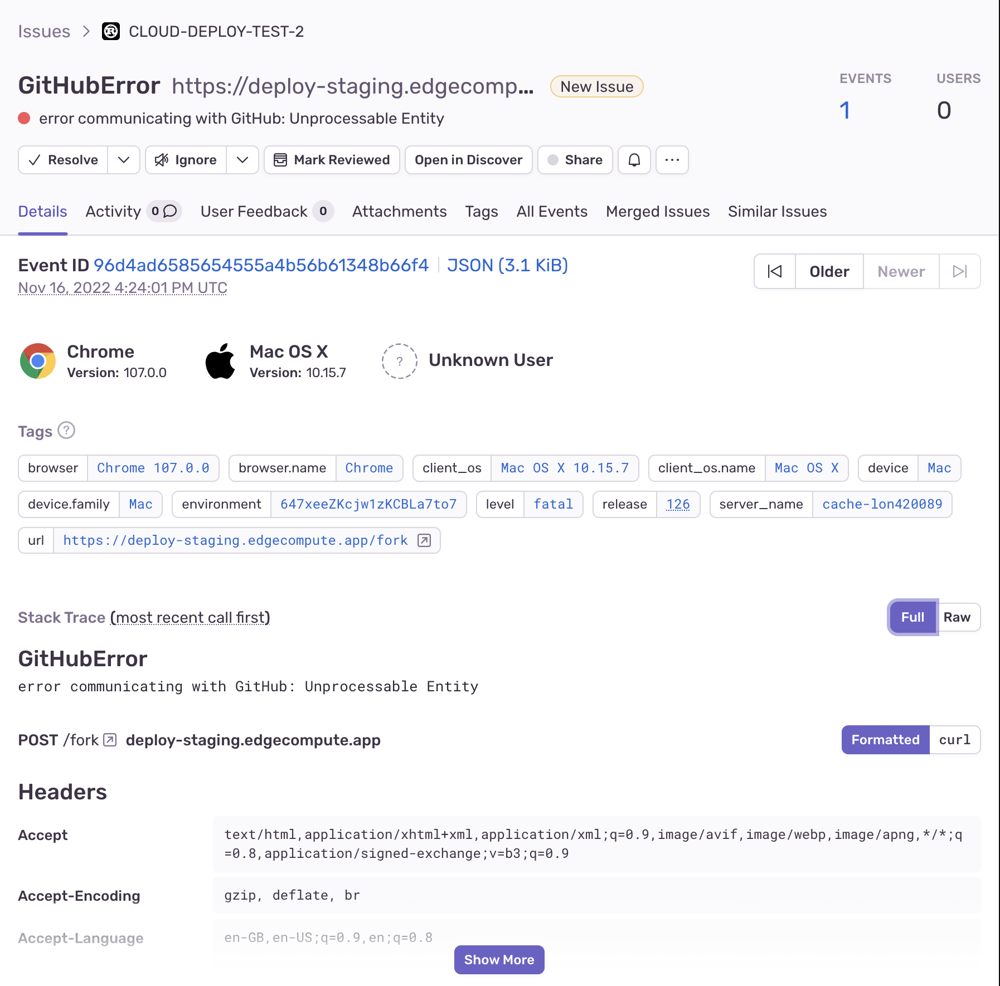

# raven-ecp

Send error reports from Rust Compute@Edge services to Sentry.



## Usage

Add the crate to your `Cargo.toml`:

```toml
raven-ecp = "0.1.0"
```

Configure the `sentry` backend locally (optional):

```toml
[local_server]

  [local_server.backends]

    [local_server.backends.sentry]
      url = "https://o122324.ingest.sentry.io"
```

Configure the `sentry` backend on your Fastly service:

```sh
$ fastly backend create --address o122324.ingest.sentry.io --version latest --autoclone
```

Wrap your main logic with an error handler in order to catch exceptions:

```rust
#[fastly::main]
fn main(req: Request) -> Result<Response, fastly::Error> {
    let raven = Raven::from_dsn_and_backend(
        Url::parse(
            "https://abcdef@o122324.ingest.sentry.io/1234",
        )?,
        "sentry",
    );

    match handle_request(req) {
      Ok(resp) => Ok(resp),
      Err(err) => {
          raven.report_error(err, &req_metadata)?;
          Ok(Response::from_status(500))
      }
    }
}

fn handle_request(req: Request) -> Result<Response, fastly::Error> {
    let beresp = req.send("origin_0")?;
    Ok(beresp)
}
```

Re-deploy your application, trigger an error, and check the Sentry dashboard for the error report:

```
$ fastly compute publish
```
